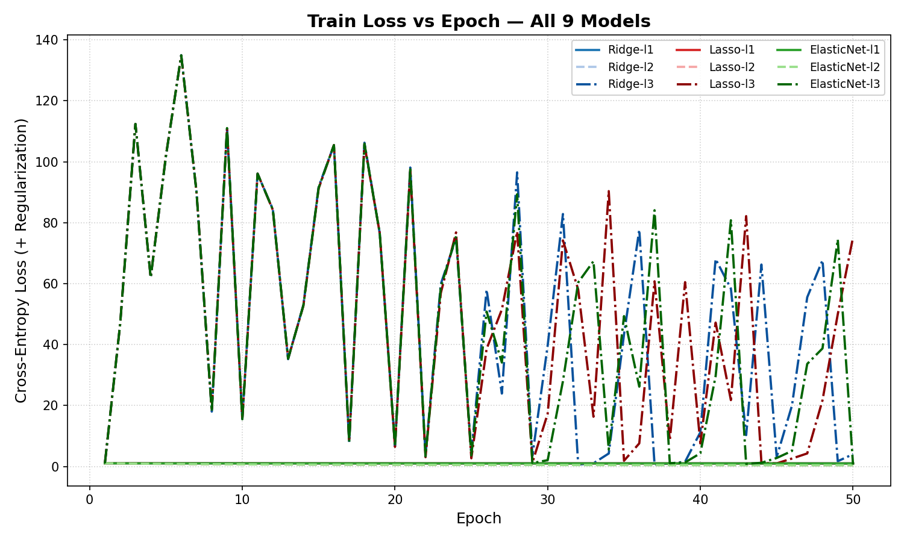
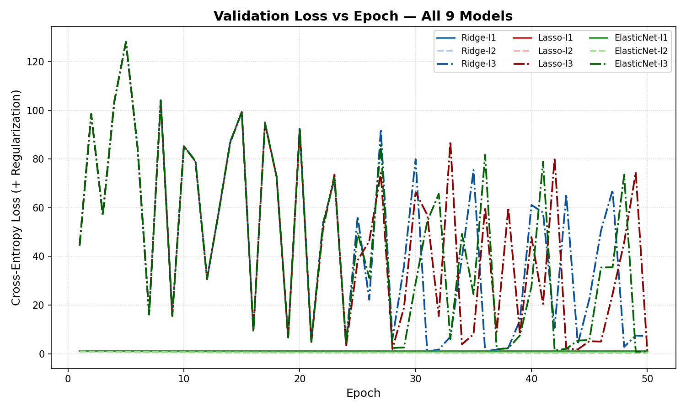
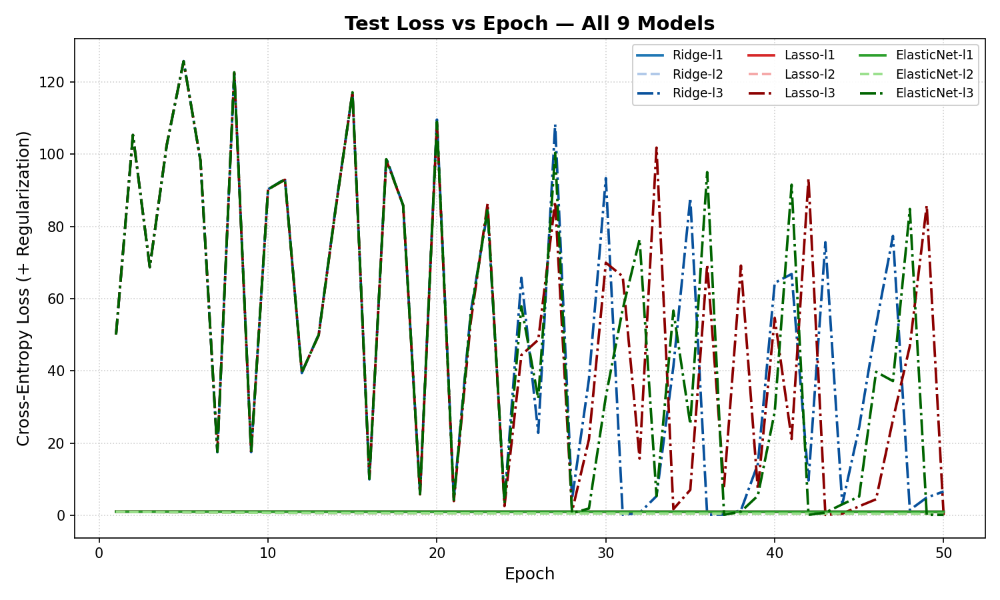

#  Iris Softmax Classifier

A from-scratch implementation of **Softmax Regression** on the Iris dataset using **PyTorch**, developed as part of the CMPE 442 Introduction to Machine Learning course at TED University.

---

##  Project Overview

This project implements multiclass softmax regression **without using `nn.Linear`** — weights and biases are defined as raw `torch.nn.Parameter` objects and the forward pass is computed via `torch.matmul`.

Three polynomial feature expansions are evaluated via **3-fold cross-validation**, and the best degree is used to train **9 model combinations** across three regularization techniques and three learning rates.

---

##  Project Structure
```
iris-softmax-classifier/
├── data_utils.py      # Dataset loading, splitting, and polynomial feature expansion
├── model.py           # SoftmaxRegression model (nn.Parameter only, no nn.Linear)
├── trainer.py         # Training loop, regularization, cross-validation
├── plot.py            # Loss curve figures using matplotlib
├── main.py            # Entry point — runs the full experiment pipeline
├── train_loss.png     # Train loss vs epoch (all 9 models)
├── val_loss.png       # Validation loss vs epoch (all 9 models)
├── test_loss.png      # Test loss vs epoch (all 9 models)
└── README.md
```

---

##  Setup & Installation

**Requirements:** Python 3.8+

Install dependencies:
```bash
pip install torch scikit-learn matplotlib numpy
```

---

##  Usage
```bash
python main.py
```

This will:
1. Load and split the Iris dataset (70% train / 15% val / 15% test)
2. Build linear, quadratic, and cubic polynomial features
3. Run 3-fold cross-validation to select the best polynomial degree
4. Train 9 models (3 regularizations × 3 learning rates) for 50 epochs
5. Save `train_loss.png`, `val_loss.png`, `test_loss.png`
6. Print final metrics for all 9 models

---

##  Model Details

| Component | Details |
|-----------|---------|
| Model | Softmax Regression |
| Parameters | `torch.nn.Parameter` (no `nn.Linear`) |
| Forward Pass | `torch.matmul(X, W) + b` |
| Loss | CrossEntropyLoss + Regularization |
| Optimizer | SGD |
| Epochs | 50 |
| CV Folds | 3 |

### Polynomial Feature Expansion

| Degree | Features | Terms |
|--------|----------|-------|
| 1 — Linear | 4 | xᵢ |
| 2 — Quadratic | 14 | xᵢ, xᵢ², xᵢxⱼ |
| 3 — Cubic | 34 | + xᵢ³, xᵢ²xⱼ, xᵢxⱼxₖ |

### Regularization Techniques

| Type | Formula |
|------|---------|
| Ridge (L2) | λ · Σ wᵢ² |
| Lasso (L1) | λ · Σ \|wᵢ\| |
| ElasticNet | λ · (0.5·L1 + 0.5·L2) |

### Learning Rates

| Key | Value | Interval |
|-----|-------|----------|
| l1 | 0.00001 | [0.00001, 0.00002] |
| l2 | 0.0015 | [0.001, 0.002] |
| l3 | 0.15 | [0.1, 0.2] |

---

##  Results

**Best polynomial degree selected by 3-fold CV:** Quadratic (14 features)

| Degree | Mean CV Val Loss |
|--------|-----------------|
| Linear (4 features) | 1.0882 |
| **Quadratic (14 features)** | **0.4388** ✅ |
| Cubic (34 features) | 24.9124 |

**Best model among 9 combinations:** Ridge + l2

| Metric | Value |
|--------|-------|
| Accuracy | 0.9565 |
| Precision (macro) | 0.9630 |
| Recall (macro) | 0.9583 |
| F1-Score (macro) | 0.9582 |

---

##  Loss Curves

### Train Loss vs Epoch


### Validation Loss vs Epoch


### Test Loss vs Epoch


---

## 👤 Author

**Sarper Sakmak**
Section: 01
TED University — Software Engineering Department
CMPE 442 Introduction to Machine Learning, Spring 2026

---

##  References

- Fisher, R. A. (1936). *The use of multiple measurements in taxonomic problems.*
- Paszke, A. et al. (2019). *PyTorch: An Imperative Style, High-Performance Deep Learning Library.*
- Pedregosa, F. et al. (2011). *Scikit-learn: Machine Learning in Python.*
```

